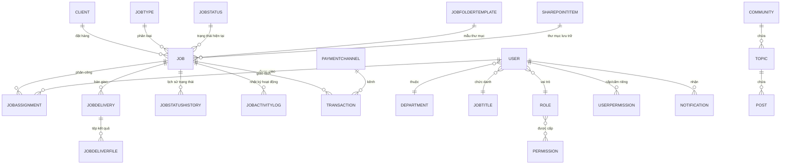
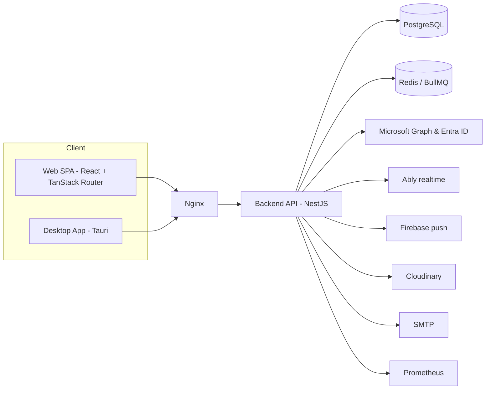

# Dữ liệu & Tích hợp

## 1. Mô hình thực thể nghiệp vụ (mức khái niệm)

## 2. Từ điển thực thể chính

| Thực thể | Mục đích nghiệp vụ | Thuộc tính then chốt |
| --- | --- | --- |
| `Job` | Đơn vị công việc trung tâm của toàn hệ thống | `no`, `type`, `status`, `priority`, `dueAt`, `incomeCost`, `totalStaffCost`, `paymentStatus` |
| `JobAssignment` | Gắn nhân sự với job kèm chi phí | `jobId`, `userId`, `staffCost`, `assignedAt` |
| `JobDelivery` / `JobDeliverFile` | Lần bàn giao và tệp kết quả | `status`, `note`, `link`, `adminFeedback` |
| `JobStatus` | Danh mục trạng thái cấu hình được | `order`, `systemType`, `allowedRolesToSet` |
| `JobStatusHistory` | Đo thời gian ở mỗi trạng thái | `startedAt`, `endedAt`, `durationSeconds` |
| `JobActivityLog` | Nhật ký thay đổi job, có phần bảo mật | `activityType`, `metadata`, `requiredPermissionCode` |
| `Transaction` | Giao dịch tài chính gắn job | `type`, `status`, `amount`, `referenceNo`, `evidenceUrl` |
| `Client` | Khách hàng và điều khoản thương mại | `type`, `currency`, `paymentTerms`, `taxId` |
| `PaymentChannel` | Kênh thu/chi và cấu trúc phí | `type`, `feeRate`, `fixedFee`, `isActive` |
| `User` | Nhân sự và tài khoản đăng nhập | `code`, `email`, `role`, `department`, `jobTitle`, `managerId`, MFA |
| `Role` / `Permission` / `UserPermission` | Mô hình phân quyền hai lớp | `entityAction`, `isDenied` |
| `SharepointItem` | Ánh xạ thư mục/tệp SharePoint | `itemId`, `webUrl`, `syncStatus`, `isAnonymous` |
| `SystemAuditLog` | Kiểm toán toàn hệ thống | `actor`, `action`, `module`, `oldValues`, `newValues` |
| `Notification` | Thông báo tới người dùng | `type`, `status`, `redirectUrl` |
| `Community` / `Topic` / `Post` | Không gian trao đổi nội bộ | `code`, `type`, `isPinned` |
| `SupportTicket` | Yêu cầu hỗ trợ nội bộ | `category`, `status` |

## 3. Tích hợp bên thứ ba

| Hệ thống | Vai trò nghiệp vụ | Ghi chú |
| --- | --- | --- |
| **Microsoft Entra ID (Azure AD)** | Đăng nhập một lần bằng tài khoản công ty | Lưu access/refresh token theo người dùng |
| **Microsoft Graph / SharePoint** | Tạo, nhân bản, duyệt và chia sẻ thư mục job | Trạng thái đồng bộ theo dõi được, cho phép đồng bộ lại |
| **Ably** | Kênh realtime cho thông báo và cập nhật tức thời | Gửi qua tiến trình nền |
| **Firebase Cloud Messaging** | Thông báo đẩy tới thiết bị đã đăng ký | Gắn với `UserDevices` |
| **Web Push (browser subscription)** | Thông báo trên trình duyệt | Lưu endpoint và khoá đăng ký |
| **SMTP / Mailer** | Email giao dịch: đặt lại mật khẩu, thông báo quan trọng | Có mẫu email |
| **Cloudinary** | Lưu trữ ảnh: avatar, gallery, bằng chứng thanh toán | |
| **Redis** | Bộ nhớ đệm và hàng đợi BullMQ | |
| **PostgreSQL** | CSDL nghiệp vụ chính | |
| **Prometheus** | Thu thập metrics vận hành | |

## 4. Tác vụ nền & tự động hoá

| Tác vụ | Kích hoạt | Kết quả nghiệp vụ |
| --- | --- | --- |
| Nhắc deadline job | Cron hằng ngày 07:00 | Thông báo `JOB_DEADLINE_REMINDER` cho job sắp đến hạn |
| Phát tán thông báo | Sự kiện nghiệp vụ | Ghi bản ghi thông báo + đẩy realtime + push |
| Đồng bộ SharePoint khi tạo job | Sự kiện `job.created` | Sinh thư mục job theo mẫu, cập nhật `syncStatus` |
| Chi trả hàng loạt | Thao tác của kế toán | Sinh loạt giao dịch `PAYOUT`, cập nhật `payoutDate` |
| Xuất Excel | Yêu cầu người dùng | Tệp báo cáo tải về |

## 5. Yêu cầu báo cáo

| Báo cáo | Đối tượng | Nội dung |
| --- | --- | --- |
| Dashboard cá nhân | Mọi nhân sự | Job đang làm, sắp đến hạn, quá hạn, hoạt động theo ngày |
| Tổng quan hệ thống | Quản lý, Admin | Khối lượng job, phân bố trạng thái, xu hướng theo kỳ |
| Báo cáo doanh thu | Ban điều hành, Kế toán | Doanh thu theo kỳ / khách hàng / loại job |
| Hiệu quả tài chính | Ban điều hành | Doanh thu − chi phí nhân sự, biên lợi nhuận theo job |
| Chỉ số hiệu suất | Quản lý | Thời gian trung bình mỗi trạng thái, tỉ lệ đúng hạn |
| Sổ cái giao dịch | Kế toán | Toàn bộ giao dịch có lọc và truy vết chứng từ |
| Audit log | Admin | Truy vết thao tác theo phân hệ, người thực hiện, đối tượng |

## 6. Kiến trúc triển khai (tóm tắt)

