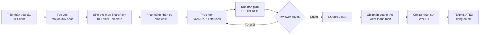
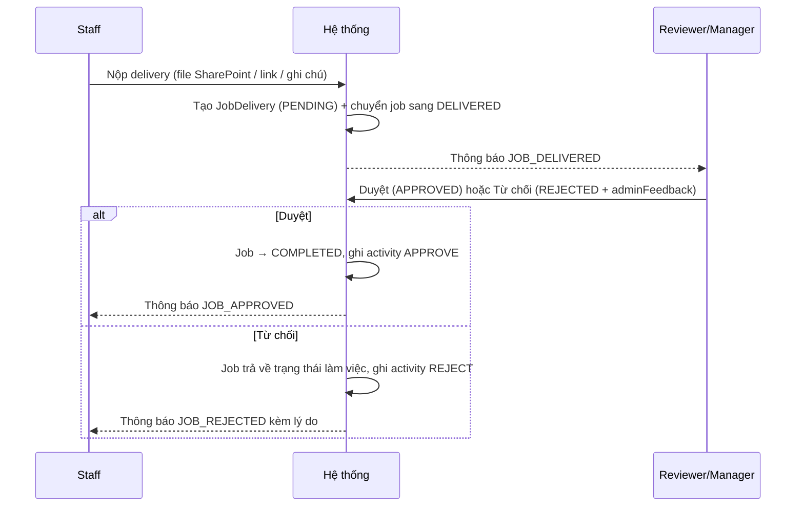
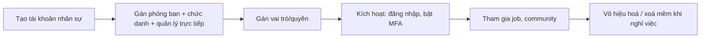

# Quy trình nghiệp vụ

## 1. Vòng đời Job (Job Lifecycle)

### 1.1 Mô hình trạng thái

Trạng thái job là **dữ liệu cấu hình được**, không hard-code. Mỗi `JobStatus` có: mã, tên hiển
thị, màu, thứ tự (`order`), trạng thái kế tiếp/trước, và phân loại hệ thống (`systemType`):

| systemType | Ý nghĩa nghiệp vụ |
| --- | --- |
| `STANDARD` | Trạng thái làm việc thông thường (To do, In Progress…) |
| `DELIVERED` | Đã nộp bàn giao, chờ nghiệm thu |
| `COMPLETED` | Đã hoàn thành công việc, chưa đóng hồ sơ |
| `TERMINATED` | Kết thúc vòng đời (Finished, Cancelled, Closed) |

Mỗi trạng thái khai báo `allowedRolesToSet` — vai trò nào được phép chuyển job **vào** trạng
thái đó. Mọi lần chuyển trạng thái ghi một bản ghi `JobStatusHistory` với thời điểm vào/ra và
`durationSeconds`, phục vụ đo thời gian chu trình.

### 1.2 Thuộc tính điều phối

- **Mức ưu tiên**: `LOW`, `MEDIUM`, `HIGH`, `URGENT`.
- **Thời hạn**: `startedAt`, `dueAt`, `completedAt`, `finishedAt`.
- **Tài chính**: `incomeCost` (doanh thu), `totalStaffCost` (tổng chi phí nhân sự), `paymentStatus` (`PAID`/`PENDING`/`UNPAID`/`FAILED`), `payoutDate`.
- **Xoá mềm**: `deletedAt` — job xoá vẫn khôi phục được (restore).

## 2. Quy trình bàn giao & nghiệm thu (Delivery & Review)

Một job có thể có **nhiều lần bàn giao**; mỗi lần lưu file kết quả (`JobDeliverFile` gắn với
SharePoint), link ngoài, ghi chú và phản hồi của người duyệt.

## 3. Quy trình tài chính

### 3.1 Phải thu (Receivable — dòng tiền vào)

1. Job có `incomeCost` và khách hàng gắn kèm (`Client` với `paymentTerms`, `currency`).
2. Job hoàn thành → xuất hiện trong danh sách **Receivables**.
3. Kế toán ghi nhận giao dịch `INCOME` gắn job + client + kênh thanh toán + bằng chứng (`evidenceUrl`, `referenceNo`).
4. `paymentStatus` của job chuyển sang `PAID`; ghi activity `PAID` và thông báo `JOB_PAID`.

### 3.2 Chi trả (Payout — dòng tiền ra)

1. Mỗi `JobAssignment` mang `staffCost` của một nhân sự trên một job.
2. Job đủ điều kiện chi trả xuất hiện trong danh sách **Pending Payouts**.
3. Kế toán chạy **bulk payout** cho nhiều job/nhân sự trong một kỳ.
4. Hệ thống sinh giao dịch `PAYOUT` gắn `assignmentId` + kênh thanh toán, đặt `payoutDate`.
5. Nhân sự nhận thông báo và tra cứu được lịch sử thu nhập theo job.

Loại giao dịch hỗ trợ: `INCOME`, `PAYOUT`, `REFUND`; trạng thái: `PENDING`, `COMPLETED`,
`FAILED`, `CANCELLED`. Toàn bộ giao dịch tập trung trong **Ledger** (sổ cái) truy vấn được
theo job, loại, trạng thái và thời gian.

### 3.3 Biên lợi nhuận theo job

> Lợi nhuận job = `incomeCost` − `totalStaffCost` (tổng `staffCost` của các assignment).

## 4. Quy trình quản trị nhân sự

- Mã nhân sự (`code`), email công ty và username là duy nhất.
- Quan hệ quản lý theo cây (`manager` ↔ `reports`).
- Vô hiệu hoá bằng `isActive` / `deletedAt`; hỗ trợ khôi phục (`USER_RESTORED`).

## 5. Quy trình thông báo & nhắc việc

| Sự kiện | Người nhận | Kênh |
| --- | --- | --- |
| Tạo job (`JOB_CREATED`) | Người liên quan, reviewer | In-app realtime, push |
| Được phân công (`JOB_ASSIGNED_MEMBER`) | Nhân sự được giao | In-app, push, email |
| Nộp bàn giao (`JOB_DELIVERED`) | Reviewer | In-app, push |
| Duyệt / Từ chối (`JOB_APPROVED` / `JOB_REJECTED`) | Nhân sự bàn giao | In-app, push |
| Sắp đến hạn (`JOB_DEADLINE_REMINDER`) | Nhân sự & quản lý job | Tự động hằng ngày 07:00 |
| Chờ chi trả / Đã chi trả (`JOB_WAITING_PAYOUT`, `JOB_PAID`) | Kế toán, nhân sự | In-app, email |
| Sự cố / báo lỗi (`ISSUE_REPORT`) | Quản trị hệ thống | In-app |

Thông báo có trạng thái `SEEN`/`UNSEEN`, hỗ trợ đánh dấu đã đọc từng cái hoặc toàn bộ, gửi
theo người dùng, theo danh sách người dùng hoặc theo vai trò. Việc phát tán được xử lý **bất
đồng bộ qua hàng đợi** để không chặn thao tác nghiệp vụ.

## 6. Quy trình hỗ trợ nội bộ

Nhân sự tạo **Support Ticket** theo phân loại (`BUG`, `JOB`, `SYSTEM`, `BILLING`, `ACCOUNT`,
`OTHER`); ticket đi qua trạng thái `OPEN` → `IN_PROGRESS` → `RESOLVED` → `CLOSED` và hiển thị
trong Admin Inbox.
