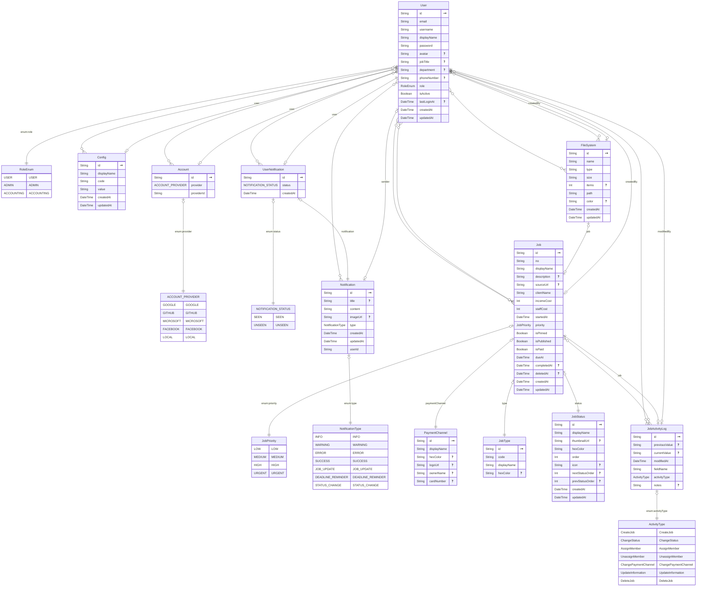

```mermaid
erDiagram

        RoleEnum {
            USER USER
ADMIN ADMIN
ACCOUNTING ACCOUNTING
        }
    


        ACCOUNT_PROVIDER {
            GOOGLE GOOGLE
GITHUB GITHUB
MICROSOFT MICROSOFT
FACEBOOK FACEBOOK
LOCAL LOCAL
        }
    


        JobPriority {
            LOW LOW
MEDIUM MEDIUM
HIGH HIGH
URGENT URGENT
        }
    


        ActivityType {
            CreateJob CreateJob
ChangeStatus ChangeStatus
AssignMember AssignMember
UnassignMember UnassignMember
ChangePaymentChannel ChangePaymentChannel
UpdateInformation UpdateInformation
DeleteJob DeleteJob
        }
    


        NOTIFICATION_STATUS {
            SEEN SEEN
UNSEEN UNSEEN
        }
    


        NotificationType {
            INFO INFO
WARNING WARNING
ERROR ERROR
SUCCESS SUCCESS
JOB_UPDATE JOB_UPDATE
DEADLINE_REMINDER DEADLINE_REMINDER
STATUS_CHANGE STATUS_CHANGE
        }
    
  "User" {
    String id "🗝️"
    String email 
    String username 
    String displayName 
    String password 
    String avatar "❓"
    String jobTitle "❓"
    String department "❓"
    String phoneNumber "❓"
    RoleEnum role 
    Boolean isActive 
    DateTime lastLoginAt "❓"
    DateTime createdAt 
    DateTime updatedAt 
    }
  

  "Config" {
    String id "🗝️"
    String displayName 
    String code 
    String value 
    DateTime createdAt 
    DateTime updatedAt 
    }
  

  "Account" {
    String id "🗝️"
    ACCOUNT_PROVIDER provider 
    String providerId 
    }
  

  "FileSystem" {
    String id "🗝️"
    String name 
    String type 
    String size 
    Int items "❓"
    String path 
    String color "❓"
    DateTime createdAt 
    DateTime updatedAt 
    }
  

  "Job" {
    String id "🗝️"
    String no 
    String displayName 
    String description "❓"
    String sourceUrl "❓"
    String clientName 
    Int incomeCost 
    Int staffCost 
    DateTime startedAt 
    JobPriority priority 
    Boolean isPinned 
    Boolean isPublished 
    Boolean isPaid 
    DateTime dueAt 
    DateTime completedAt "❓"
    DateTime deletedAt "❓"
    DateTime createdAt 
    DateTime updatedAt 
    }
  

  "PaymentChannel" {
    String id "🗝️"
    String displayName 
    String hexColor "❓"
    String logoUrl "❓"
    String ownerName "❓"
    String cardNumber "❓"
    }
  

  "JobType" {
    String id "🗝️"
    String code 
    String displayName 
    String hexColor "❓"
    }
  

  "JobStatus" {
    String id "🗝️"
    String displayName 
    String thumbnailUrl "❓"
    String hexColor 
    Int order 
    String icon "❓"
    Int nextStatusOrder "❓"
    Int prevStatusOrder "❓"
    DateTime createdAt 
    DateTime updatedAt 
    }
  

  "JobActivityLog" {
    String id "🗝️"
    String previousValue "❓"
    String currentValue "❓"
    DateTime modifiedAt 
    String fieldName 
    ActivityType activityType 
    String notes "❓"
    }
  

  "UserNotification" {
    String id "🗝️"
    NOTIFICATION_STATUS status 
    DateTime createdAt 
    }
  

  "Notification" {
    String id "🗝️"
    String title "❓"
    String content 
    String imageUrl "❓"
    NotificationType type 
    DateTime createdAt 
    DateTime updatedAt 
    String userId 
    }
  
    "User" o|--|| "RoleEnum" : "enum:role"
    "User" o{--}o "UserNotification" : ""
    "User" o{--}o "Job" : ""
    "User" o{--}o "Job" : ""
    "User" o{--}o "FileSystem" : ""
    "User" o{--}o "FileSystem" : ""
    "User" o{--}o "Account" : ""
    "User" o{--}o "Notification" : ""
    "User" o{--}o "JobActivityLog" : ""
    "User" o{--}o "Config" : ""
    "Config" o|--|o "User" : "user"
    "Account" o|--|| "ACCOUNT_PROVIDER" : "enum:provider"
    "Account" o|--|| "User" : "user"
    "FileSystem" o|--|| "User" : "createdBy"
    "FileSystem" o|--|o "Job" : "job"
    "Job" o|--|| "JobType" : "type"
    "Job" o|--|| "User" : "createdBy"
    "Job" o|--|| "PaymentChannel" : "paymentChannel"
    "Job" o|--|| "JobStatus" : "status"
    "Job" o{--}o "JobActivityLog" : ""
    "Job" o|--|| "JobPriority" : "enum:priority"
    "JobActivityLog" o|--|| "Job" : "job"
    "JobActivityLog" o|--|| "User" : "modifiedBy"
    "JobActivityLog" o|--|| "ActivityType" : "enum:activityType"
    "UserNotification" o|--|| "User" : "user"
    "UserNotification" o|--|| "Notification" : "notification"
    "UserNotification" o|--|| "NOTIFICATION_STATUS" : "enum:status"
    "Notification" o|--|o "User" : "sender"
    "Notification" o|--|| "NotificationType" : "enum:type"
```
